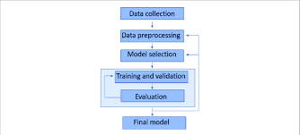

## Netflix Data Analysis Project
 Overview
This project involves a comprehensive analysis of the Netflix Movies and TV Shows dataset, which contains metadata about titles available on Netflix as of the last update. The goal is to explore patterns, trends, and insights that can help understand Netflix's content distribution across genres, countries, time, and more.
The analysis is structured into multiple phases: data cleaning, exploratory data analysis (EDA), visualization, validation and conclusion  based on insights.

## Dataset Description
Source: The dataset was sourced from Kaggle and is publicly available under the title Netflix Movies and TV Shows.

URL: Netflix Dataset on Kaggle

Size: ~8800 rows × 12 columns

# Features include:

show_id: Unique ID for every show

type: Indicates whether it is a Movie or TV Show

title: Title of the show

director: Director name

cast: List of cast members

country: Country of origin

date_added: Date when added to Netflix

release_year: Year of release

rating: Age rating (e.g., TV-MA, PG, etc.)

duration: Duration (minutes or seasons)

listed_in: Genre categories

description: Brief description of the show/movie

 # Data Cleaning and preprocessing
Removed duplicate entries and null values.

Parsed date_added into datetime format for temporal analysis.

Extracted numeric values from duration for better comparison.

Split multi-value columns like cast, country, and listed_in for more granular insights.

Standardized country names and ratings for consistency.

 # Exploratory Data Analysis (EDA)
The following questions were explored during EDA:

Distribution of Movies vs. TV Shows

Which type dominates the platform?

Content Added Over Time

How frequently is content added by year or month?

Top Contributing Countries

Which countries produce the most content for Netflix?

Popular Genres

Which genres are most represented?

Content Duration Analysis

What are the typical durations of movies and TV shows?

Top Directors and Actors

Who are the most frequent collaborators with Netflix?

Rating Distribution

What kind of content ratings dominate?

📈 Visualizations
We used Matplotlib, Seaborn, and Plotly to generate visual insights:

Bar charts for type distribution

Line plots for content growth over the years

Word clouds for genre and actor frequency

Heatmaps for correlation between content attributes

Pie charts showing rating and country proportions

These visuals make it easier to interpret large volumes of data at a glance.

## Key Insights
Movies make up ~70% of the Netflix catalog, significantly outnumbering TV Shows.

Netflix added the highest number of titles in 2019, showing a clear growth strategy.

United States, India, and United Kingdom are the top three countries producing Netflix content.

The most common genres include International Movies, Dramas, and Comedies.

The most frequent rating is TV-MA, indicating a high volume of mature content.

Most movies last 90-100 minutes, while most TV shows span 1-2 seasons.

A few directors and actors repeatedly appear, showing favored creative partnerships.
